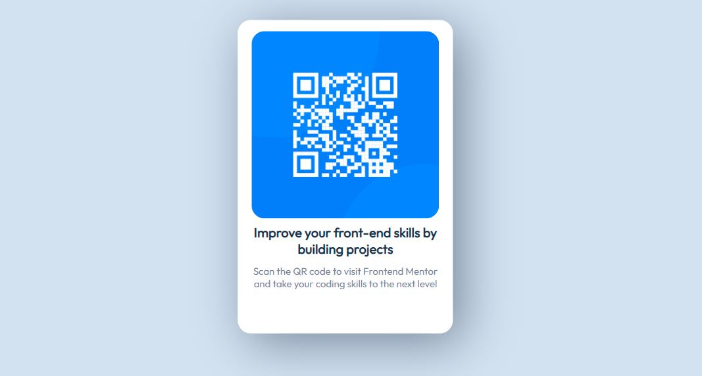

# Frontend Mentor - QR code component solution

This is a solution to the [QR code component challenge on Frontend Mentor](https://www.frontendmentor.io/challenges/qr-code-component-iux_sIO_H). Frontend Mentor challenges help you improve your coding skills by building realistic projects. 

## Table of contents

- [Overview](#overview)
  - [Screenshot](#screenshot)
- [Built with](#built-with)
- [Author](#author)

## Overview

### Screenshot

### Built with

- Semantic HTML5 markup
- CSS custom properties
- Flexbox

## Author

- LinkedIn - [Bilwa Gutthi]("https://linkedin.com/in/bilwa-gutthi")
- Frontend Mentor - [@bilwagutthi](https://www.frontendmentor.io/profile/bilwagutthi)
- Twitter - [@bilwagutthi](https://www.twitter.com/bilwagutthi)
